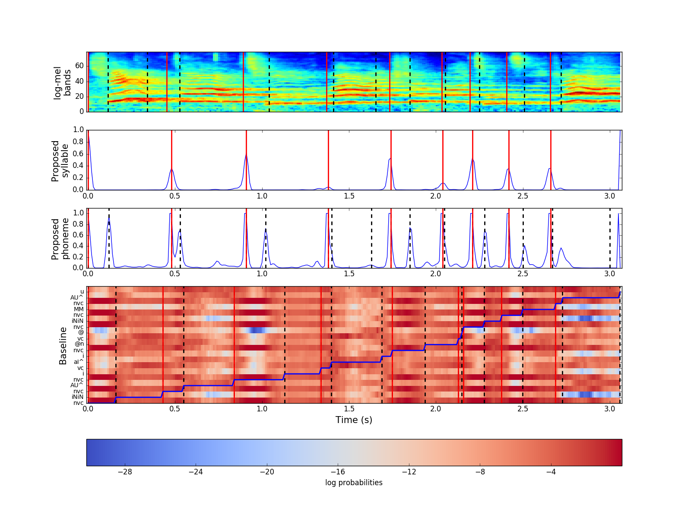

# INTERSPEECH 2018 submission 01
Singing voice phoneme segmentation by jointly learning syllable and phoneme onset positions.

The code in the repository is for the conference review process.

For the demo of the algorithm, please check the [distribute branch](https://github.com/ronggong/interspeech2018_submission01/tree/distribute).

## A Paper complementary information

### A.1 Results example

An illustration of the result for a testing singing phrase. 
* The red and black vertical lines are respectively the syllable and phoneme onset positions 
(1st row: ground truth, 2nd and 3rd rows: proposed method detections, 
4th row: baseline method detections). 
* The blue curves in the 2nd and 3rd 
row are respectively the syllable and phoneme ODFs. 
* The 4th row shows the syllable/phoneme labels on the y axis, emission probabilities matrix at the background
and alignment path by the blue staircase line.

### A.2 Annotation units for phoneme-level

1. This table shows the annotation units used in 'pinyin', 'dianSilence' and 'details' tiers of each Praat TextGrid.

2. Chinese pinyin and X-SAMPA format are given. 

3. b,p,d,t,k,j,q,x,zh,ch,sh,z,c,s initials are grouped into one representation (not a formal X-SAMPA symbol): c  

4. v,N,J (X-SAMPA) are three special pronunciations which do not exist in pinyin.

<dl>
<table>
  <tr>
    <th></th>
    <th>Structure</th>
    <th>Pinyin[X-SAMPA]</th>
  </tr>
  <tr>
    <td rowspan="2">head</td>
    <td>initials</td>
    <td>m[m], f[f], n[n], l[l], g[k], h[x], r[r\'], y[j], w[w], {b, p, d, t, k, j, q, x, zh, ch, sh, z, c, s} - group [c] [v], [N], [J] - special pronunciations</td>
  </tr>
  <tr>
    <td>medial vowels</td>
    <td>i[i], u[u], ü[y]</td>
  </tr>
  <tr>
    <td rowspan="4">belly</td>
    <td>simple finals</td>
    <td>a[a"], o[O], e[7], ê[E], i[i], u[u], ü[y], i (zhi,chi,shi) [1], i (ci,ci,si) [M],</td>
  </tr>
  <tr>
    <td>compound finals</td>
    <td>ai[aI^], ei[eI^], ao[AU^], ou[oU^]</td>
  </tr>
  <tr>
    <td>nasal finals</td>
    <td>an[an], en[@n], in[in], ang[AN], eng[7N], ing[iN], ong[UN]</td>
  </tr>
  <tr>
    <td>retroflexed finals</td>
    <td>er [@][r\']</td>
  </tr>
  <tr>
    <td>tail</td>
    <td></td>
    <td>i[i], u[u], n[n], ng[N]</td>
  </tr>
</table>
</dl>

### A.3 Phoneme and syllable detection results
We trained both proposed and baseline models 5 times with different random seeds. The mean and the std are reported.
#### A.3.1 Proposed method

|           | Phoneme (mean, std) | Syllable (mean, std) |
|-----------|---------------------|----------------------|
| Precision | 75.73, 0.60         | 76.05, 0.41          |
| Recall    | 74.77, 0.60         | 75.59, 0.40          |
| F1        | 75.25, 0.60         | 75.82, 0.40          |

#### A.3.2 Baseline method

|           | Phoneme (mean, std) | Syllable (mean, std) |
|-----------|---------------------|----------------------|
| Precision | 42.92, 0.89         | 41.16, 1.02          |
| Recall    | 46.18, 0.96         | 40.91, 1.02          |
| F1        | 44.49, 0.92         | 41.04, 1.02          |

## B Code usage
### B.1 First thing to do
* Use python 2.7.* I haven't test the code on python3  
* Install the requirements.txt

### B.2 Download the 3 jingju a cappella singing voice datasets
[part 1](https://doi.org/10.5281/zenodo.780559)  
[part 2](https://doi.org/10.5281/zenodo.842229)  
[part 3](https://doi.org/10.5281/zenodo.1185123)  
If you only want to reproduce the experiment results in the paper, 
you only need to download the part 3 because the part 1 and 2 are used
for training the models.

### B.3 Set the paths
Once datasets are downloaded, you need to set the paths to let the 
program knows where are they. 
#### B.3.1 Set the datasets path
What you need to set in `./general/filePathShared.py` are:
* Set `path_jingju_dataset` to the parent path of these three datasets.
* Set `primarySchool_dataset_root_path` to the path of the interspeech2018 dataset (for reproducing the experiments).
* Set `nacta_dataset_root_path` to the path of the jingju dataset part1 (for training the models).
* Set `nacta2017_dataset_root_path` to the path the jingju dataset part2 (for training the models).
#### B.3.2 Set the training data path
And in both `./general/filePathHsmm.py` and `./general/filePathJoint.py`:
* Set `training_data_joint_path` to where putting the training features, labels
for the proposed joint model. (for training the models)
* Set `training_data_hsmm_path` to where putting these files for the baseline
HSMM emission model. (for training the models)

### B.4 How to use pre-trained models to reproduce the results?
As you may see, there is a _cnnModels_ folder in the repo, where we store all
the pre-trained models. To use these models, you should run the following scripts:
* `proposed_method_pipeline.py` will calculate the syllable and phoneme onset
results using the proposed method, then save them to `./eval/results/joint/`.
* `baseline_forced_alignment.py` will calculate those results using the baseline
 HSMM forced alignment, then save them to `./eval/results/hsmm/`.

For each model, we have trained five times, to get the mean and std statistics, you
need to run `eval_stats.py`. The final results will be put in `./eval/hsmm/` or 
`./eval/joint/` folds.
* _*phoneme_onset_all.txt_: phoneme onset detection results
* _*phoneme_segment_all.txt_: phoneme segmentation results
* _*syllable_onset_all.txt_: syllable onset detection results
* _*syllalbe_segment_all.txt_: syllable segmentation results

There are two columns in each result file, the 1st column is the mean, the 2nd
is the std. For onset detection results, the 3rd row is the f1-measure
without considering the label and the tolerance is 0.025s.

### B.5 How to get the features, labels and samples weights?
Make sure that you have downloaded all three datasets and set the `training_data_joint_path`
and `training_data_hsmm_path`. In `./training_feature_collection` folder, you can:
* Run `training_sample_collection_joint.py` for the proposed method
* Run `training_sample_collection_hsmm.py` for the baseline method

The training materials will be stored in the paths you have set.

### B.6 How to train the models?
We have provided the training scripts. You can find them in `./model_training/train_scripts` folder.
Before running them, you need change the necessary paths (check 3.2) to direct to the training materials
which you obtained in the previous step.

## Questions?
Feel free to open an issue or email me: rong.gong\<at\>upf.edu
